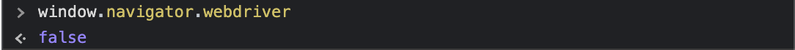
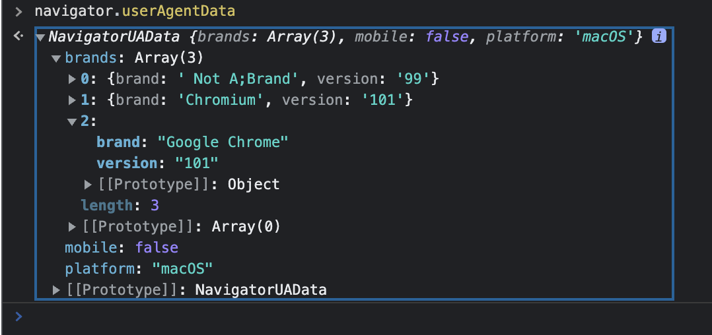

# '웹 크롤러, 창과 방패'

Python으로 제작한 프로그램 중에 타오바오 사이트를 로그인해서 요청 헤더 쿠키값을 긁어와서 이용하는 부분이 있는데 몇주 전부터 크롬드라이버로 접속을 하게 되면 노캡챠 슬라이더가 생겼다. 원래 슬라이더를 셀레니움를 이용해 넘겨보려 했는데 슬라이더 어느 부분을 클릭해서 드레그 해보려고 시도해도 unclickable로 실패.. 구글링을 열심히 해보지만 해결책은 찾기 어려웠었다.

하지만 일반사용자 크롬으로 접속시엔 슬라이더가 생기지 않는 걸 보니 크롬드라이버 접속을 인식하는 걸까? 여러 웹사이트에 봇 유입 방지를 위해 여러 방책들이 있다.

<br /><br />
1. Javascript 스크립트를 심어 놓음.
window.navigator.webdriver를 리턴하게 스크립트를 심어 놓으면 일반 크롬은 false로 응답하는 반면 크롬드라이버로 실행된 크롬에선 undefined로 리턴해서 봇 판별을 할 수 있다.

하지만 이 부분은 옵션에 **'--disable-blick-features=AutomationControlled'** 를 추가하면 간단하게 해결 가능했다.

```python
from selenium import webdriver
options = webdriver.ChromeOptions()
options.add_argument('--disable-blick-features=AutomationControlled')
```


<br /><br />
2. clienthints, navigator.userAgentData 확인
User Agent도 마찬가지로 웹드라이버 옵션에 추가해서 손쉽게 조작이 가능하다.

```python
from selenium import webdriver
options = webdriver.ChromeOptions()
options.add_argument('user-agent=Mozilla/5.0 (Macintosh; Intel Mac OS X 10_15_7) AppleWebKit/537.36 (KHTML, like Gecko) Chrome/101.0.4951.54 Safari/537.36')
```

이렇게 작성만 해주면 Mac OS의 크롬 101.0.4951.54 버전으로 접속을 한 것으로 조작할 수 있다.



<br /><br />
3. Chromedriver 탐지

최신 크롬드라이버는 이 방법으로 탐지가 힘들다곤 하지만 크롬드라이버를 항상 최신으로 유지해주긴 힘들다. 
일반 IDE로는 수정이 불가능걸로 알고있고 나같은 경운 Ubuntu(Linux) Vim을 이용해 Chromedriver를 수정해 주었다. (nano로는 수정은 되지만 저장을 하면 chromedriver가 -11 error를 내면서 작동 안됨)

Chromedriver 내부에 call_function.js에서 이 부분을 수정해 줘야한다.
```js
var key = '$cdc_asdjflasutopfhvcZLmcfl_';
```

stackoverflow에 검색한 내용중에 key 값을 '/\$[a-z]dc_/' 정규식으로 필터링 한다고 하니 앞에 cdc부분을 전혀 다른 같은 길이의 문자열로 수정해주면 된다. 나 같은 경운 
```js
var key = '$cat_asdjflasutopfhvcZLmcfl_';
```

으로 변경 해줬을 때 브라우저도 정상 작동하고 슬라이더가 사라졌다.

Taobao말고 다른 타사이트들도 이 방법으로 봇 유입을 막는 것을 종종 봤다. Coinpan (코인 커뮤니티) 사이트도 막아놨던 것으로 기억한다.

## Vim 사용법
```bash
vim chromedriver
```
로 실행하면 다른 텍스트 에디터와 다르게 바로 수정이 가능하지 않고 단축키들을 사용해야 한다. 일단 <br />
- **'/cdc'**를 타입해서 검색해준다. <br />
- **'R'** 대문자 R을 입력하면 수정하면서 입력을 할 수 있는 모드로 변경된다 (텍스트 덮어씌우기) <br />
- **'cdc'** 부분을 다른걸로 변경해준다. <br />
- **':wp!'** 이렇게 치고 엔터를 치면 저장하면서 vim을 종료할 수 있다.

## Notepad++
- chromedriver.exe를 오른쪽 클릭해서 연결프로그램 - Notepad++ 로 실행해준다.
- **Ctrl + F**로 **'$cdc_asdjflasutopfhvcZLmcfl_'**를 검색하면 24816번째 라인에서 찾을 수 있다.
- 같은 길이, 같은 형식지만 다른 문자열로 수정한다.
- **Ctrl + S** 단축키를 사용해 저장하고 종료한다.

4. Browser Fingerprint

Browser fingerprinting is a powerful method that websites use to collect information about your browser type and version, as well as your operating system, active plugins, time zone, language, screen resolution and various other active settings.

브라우저를 통해서 브라우저 타입과 버전정보, OS, 접속자 위치, 로컬 타임존, 언어, CPU Thread 개수, 램, 해상도, 화면 크기 등등 접속자의 다양한 정보를 수집 할 수 있는데 이것을 Browser Fingerprint라고 한다.

이런 것들도 세세하게 수정이 가능하지만 한국 웹사이트들은 대부분 Browser Fingerprint를 이용해서 봇탐지를 하고 있진 않다.
