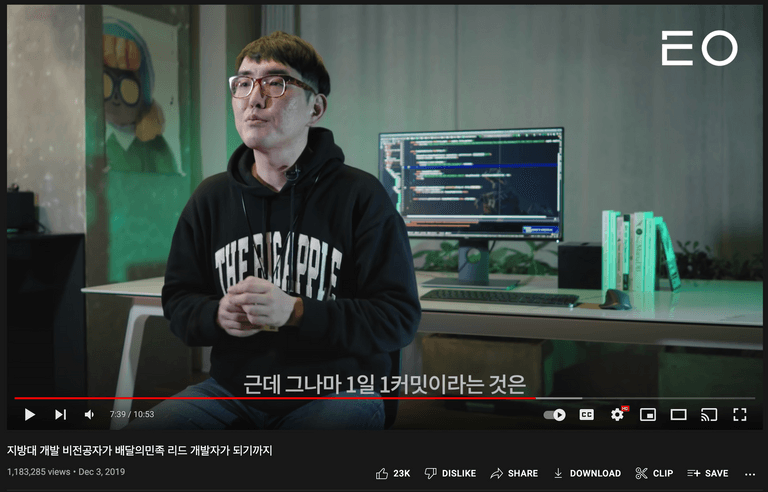
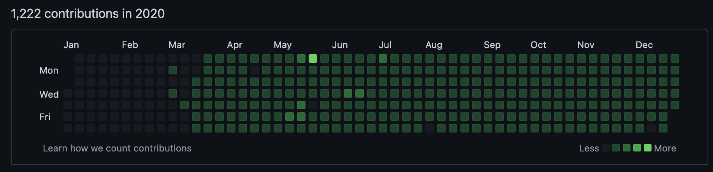

# 1일 1커밋을 시작하며..

오래 전부터 **ㅌㅇ**라는 유튜브 채널을 보면서 동기부여를 얻곤 했다. 현재는 **eo**로 채널명을 변경했고 여러 성공한 스타트업 대표 혹은 그에 준하는 능력자들의 인터뷰 영상을 제작해 업로드 하는 채널이다. 
 
 
약 2년 전 배달의민족 리드 개발자님의 영상을 보고 **1일 1커밋**을 하며 실력을 키웠다는 것을 보게 되었다.
 
 

<a href="https://www.youtube.com/watch?v=V9AGvwPmnZU" rel="유튜브 영상">유튜브 영상 바로가기</a>
 

습관을 만드는 것이야 말로 내 실력을 꾸준히 올릴 수 있는 가장 좋은 방법이라는 것은 알고 있었지만 **Github**를 그런식으로 이용할 수 있다는 것을 알게되었고 그 날 부터 잔디를 채워가기로 결정했다.
 
 
매일 양질의 코드를 푸쉬하면 좋겠지만 단 한줄이라도 코드를 푸쉬하기 위해 책상 앞에 앉는 것을 목표로 다짐을 했다.
물론 365일을 다 채우진 못했다(다사다난했던 2020년..) 하지만 2020년 3월 17일을 시작으로 2021년 2월 23일까지 단 **5일**을 제외하고 매일 잔디 심는데 성공!
 
 

 
다양한 토이 프로젝트를 진행했었던 좋은 경험이였다. 하지만 회사일에 좀 더 집중하기 위해 의무적으로 커밋하는 것을 잠시 쉬기로 결정했었다. 
 
 

그런데, 의무적으로 코드 푸쉬를 하지 않다 보니까 저녁에 프로그래밍을 하는 시간이 점점 줄기 시작했고 회사에서 개발하는 것 외는 다른 프로젝트를 잘 하지 않게 되더라..
 
 

그래서 다시 하기로 시작해보기로 다짐했고 개발하는 내용들을 블로그에 간략하게 기록을 남기기로 했다.
