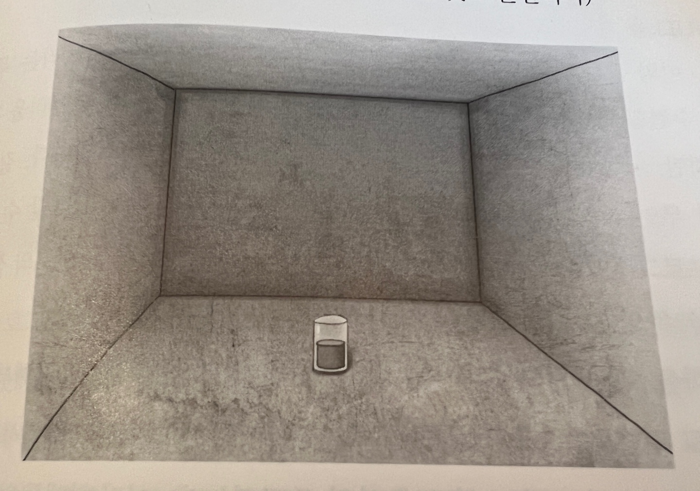

# 누워서 읽는 알고리즘

## 1장. 재즈로 여는 아침의 향기
1. 알고리즘은 프로그래밍의 꽃이며, 가볍고 경쾌한 놀이다.
2. 답을 한 방에 맞추려는 것은 '하수'가 부리는 과욕일 뿐이다. '고수'는 언제나 한 걸음씩 천천히 전진한다.
3. 버그 찾기  
    <strong>[1단계]</strong> a=b 
    <strong>[2단계]</strong> a^2=ab 
    <strong>[3단계]</strong> a^2-b^2=ab-b^2 
    <strong>[4단계]</strong> (a-b)(a+b)=b(a-b) 
    <strong>[5단계]</strong> a+b=b 
    <strong>[6단계]</strong> b+b=b 
    <strong>[7단계]</strong> 2b=b 
    <strong>[8단계]</strong> 2=1  
4. 버그를 찾는 일은 대부분 끈기와 집중력을 테스트하는 과정이다.
5. 프로그램을 작성할 때 타인의 시선을 의식하지 않고 혼자만의 코드를 작성하는 사람은 진정한 의미에서 결코 좋은 프로그래머라고 할 수 없다.
6. 좋은 프로그래머는 소설도 읽고, 영화도 보고, 농구도 하고, 기타도 치고, 정치 토론에도 참여하고, 연애도 하고, 술도 마시는 열정적인 사람이다. 진정한 상상력은 삶의 속살을 이해할 때 비로소 풍부해지기 때문이다.
7. 프로그래밍이란 사람의 삶 속에서 일어나는 구체적인 일들을 사이버 세상으로 옮겨주는 마법의 통로와 같은 역할을 한다.

## 2장. 록과 함께하는 정오의 활기
<h4>사운덱스 알고리즘</h4>

컴퓨터가 생기기전에 이름 데이터베이스의 이름과 고객이 불러주는 이름이 혼동되어 검색오류가 나는 것을 막기 위해 Margaret K. Odell과 Robert C. Russell에 의해 만들어진 알고리즘이다. 

<strong>[규칙1]</strong> 이름의 첫 번째 글자를 저장하고, 첫 번째 글자를 제외한 나머지 글자 중에서 a, e, h, i, o, u, w, y를 모두 제거한다. 
<strong>[규칙2]</strong> 이름 안에 존재하는 글자들에 다음과 같은 번호를 부여한다. 
- d, f, p, v → 1
- c, g, j, k, q, s, x, z → 2
- d, t → 3
- l → 4
- m, n → 5
- r → 6
<strong>[규칙3]</strong> 원래 이름에서 서로 인접하여 연속으로 나타나는 글자는 맨 앞에 하나만 남기고 나머지는 제거한다.  
<strong>[규칙4]</strong> 최종적인 결과를 ‘글자, 숫자, 숫자, 숫자’의 형태로 맞추기 위해서 숫자가 세 개 이상이면 나머지를 생략하고, 세 개 미만이면 뒤에 0을 붙여서 형태를 맞춘다. 

ex) ‘Gauss’ -> G200

다른 값을 입력이 되어도 결과값이 같아 혼동의 여지가 있다고 한들 의미 없는 알고리즘은 아니다. 실수로 초래되는 문제의 범위를 축소시키고 검색 속도를 빠르게 해준다는 장점이 있다.

## 3장. 하드코어로 달아오르는 뜨거운 오후

<h4>Non-programming Quiz</h4>
텅 빈 방에 컵이 있다. 컵은 곧은 원통 모양으로 아랫부분과 윗부분의 지름이 같다. 컵에는 물이 절반 정도 채워져 있다. 이 물이 절반을 넘는지 아니면 절반이 되지 않는지를 가늠할 수 있는 방법을 찾아보기 바란다. 방이 텅 비어 있으므로 사용할 수 있는 기구나 도구는 아무것도 없다. 제한 시간은 10분. (답 자체는 매우 간단하다. 방이나 물의 온도 혹은 화학반응 등을 이용하는 것처럼 억지스러운 방법은 생각하지 않기 바란다. 물을 마시는 것도 곤란하다)  

## 4장. 클래식으로 마무리하는 차분한 저녁

실전 프로그래밍에서 하는 일의 절반 이상은 자기가 아닌 다른 사람이 작성한 코드를 읽고 이해하는 일로 채워진다. 그래서 다른 사람이 작성한 코드를 읽는 것이 새로운 코드를 작성하는 것만큼 즐겁지 않은 사람은 좋은 프로그래머가 되기 어렵다. 꼭 ‘일'과 관련되어서가 아니라 그냥 ‘놀때', ‘화장실에서 일 볼때', ‘혼자서 점심 먹을 때' ‘출퇴근할 때' 등과 같은 자투리 시간을 이용해서 잡지나 가벼운 책에 실려 있는 코드를 가볍게 읽는 것이 습관이 되면 프로그래밍 실력은 놀라운 속도로 향상될 것이다.
