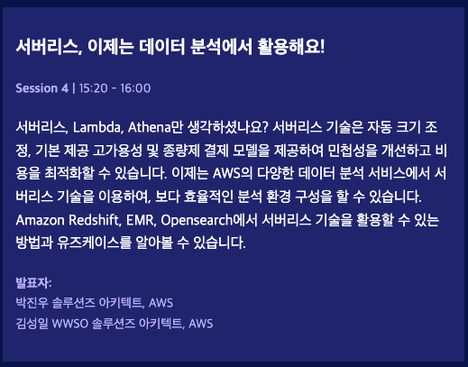
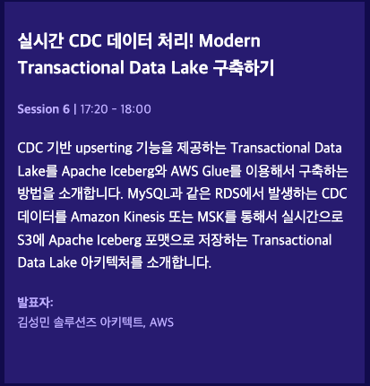

# 'AWS Summit Seoul 2023 다녀오다'

2023년 5월 3일(수) - 4일(목)

이틀간 코엑스에서 AWS Summit Seoul, 국내 최대 IT 컨퍼런스를 3년만에 오프라인으로 개최한다고 해서 트랜드 공부도 하고 클라우드 기술 공부도 할겸 회사 지원으로 다녀올 계획이다. 원래 수, 목 모두 참여 하고 싶었지만 회사 업무도 있고 이틀간 참석하면 정작 중요한 기술 주제별 강연 참석할 때 집중력이 떨어질 것 같아 둘째날만 참석하는 걸로 변경. 동시에 8개의 강연이 진행 되는데 이름을 찰떡같이 다 듣고 싶게 만들었다.. 그 중에 회사 업무와 개인적인 프로젝트에 적용하고 싶은 기술들 위주로 골라보았다.

[AWS Summit Seoul 2023, 강연 한눈에 보기](./aws_2023_agenda.pdf)

사내에 흩어진 정형, 반정형, 비정형 데이터들의 유실을 막고 데이터 재생산에 쓰일 자원을 최소화. 단한번의 검색을 통해 사내 데이터에서 가장 적합하다고 판단되는 데이터 결과값을 도출할 수 있음.
문서 뿐만 아니라, 음성과 영상 까지 Amazon Textract(문서에서 텍스트 및 데이터 추출), Transcribe(음성을 텍스트로 변환), Rekognition(이미지 및 영상 분석), Comprehend Medical(의료 텍스트에서 인사이틑 추출), Comprehend(텍스트 인사이트 추출), SageMaker(ML모델 만드는 가장 빠른 시작) 등과 연동해 데이터를 인덱스를 생성, 데이터를 자연어 질의를 통해 결과값을 도출할 수 있도록 백엔드를 구성하는 플랫폼.
프론트 경우는 드래그엔 드랍을 통해 손쉽게 구축 가능하도록 설계됨.

### DynamoDB 장단점
장점  
- 데이터가 key-value 형태로 저장된다. 
- JSON file로 저장되는 개념이라 사용하기 간편하다.
- key-value 형태 이므로 READ 속도가 빠르다. (10ms 이하의 읽기 및 쓰기 성능)
- 확장성이 좋다.(수평적. 초당 수천 건의 요청 처리 가능)
- 속성에 대한 추가와 변경이 자유롭다.
- 완전 관리형 서비스이므로 운영 부담이 발생하지 않는다.
- 요청 수에 따라 원활하게 확장되기 때문에 비용 효율적이고 IO 작업을 원활하게 지원한다.
- 성능과 가용성을 위해 데이터를 3곳의 가용 영역에 복제하여 저장하고 있다.
#### 단점
- 데이터들 간의 관계(relation)가 없기 때문에 같은 데이터가 여러 컬렉션에 중복되어 들어있을 수 있다. 
- update가 일어날 경우 모든 테이블에서 작업해주어야 한다.
큰 REST API 서비스를 운영할 경우 이를 처리할 수 있는 체계적인 API가 제공되지 않는다.
- ORM 지원 라이브러리도 없고, 있다 하더라도 메이저하지도 않아서 쓰기 힘들 수 있다.
- ORMODM : ORM과 동일하게 객체 관계로 정의한 내용을 NoSQL 형태로 매핑해주는 도우미 역할 ( MongoDB에는 Mongoose가 있다 )
- ORM : 객체와 관계형 데이터베이스의 데이터를 자동으로 매핑해주는 도우미 역할
- 여러 쿼리에 대해 일관성, 원자성을 보장하지 않는다. 즉, Transaction 이 없다. 전략으로 사용해야한다.
- 러닝커브

### DynamoDB의 역할 및 사용 사례

쓰기 집약적인 워크로드에 적합 예를 들어 사용자 액티비티 수집등에 적합하다.

사용사례
- 디즈니 플러스 메인 추천 페이지 글로벌 테이블 기능을 사용 중
- 드롭박스 mysql 클러스터 -> DynamoDB 
- 스냅챗 가변비용을 잘 사용하는 중
- tinder 몽고디비 -> DynamoDB 

### DynamoDB의 비용 최적화 방법

얼마나 읽기 쓰기 저장하는지를 알아야 비용을 최적화 할 수 있다.

사용 최적화
용량, 스토리지
스키마 디자인, 액세스 패턴, 용량 모드, 스토리지 모드

Samsung Cloud의 DynamoDB 비용 최적화 사용 사례

Auto Scaling, Reserved Capacity, Batch -> TTL

Modeling 체계 전환

standard-Infrequent Access

싱글 테이블 아이템 레벨의 엔터티 디자인
- 컴퓨팅 cost 절약
- 운영비용 효율화
- 1개의 Provisioned CU로 서비스

Reserved Capacity 
수집, 얘측, 비율산정

Stabdard_IA

### Terraform

Infrastructure as Code (IaC) is the managing and provisioning of infrastructure through code instead of through manual processes. With IaC, configuration files are created that contain your infrastructure specifications, which makes it easier to edit and distribute configurations

IaC 컴퓨터에서 읽을 수 있는 정의 파일을 사용하여 클라우드 인프라를 관리하고 프로비저닝하는 프로세스이며, 실행 가능한 문서. 인프라 Configuration이 명시된 파일을 이용해 원하는 서버 인프라를 간단한 프로세스로 구축 가능하게 도와준다.

### Nomad

서비스 스케줄러는 클러스터 내의 컴퓨팅 리소스를 관리하고 사용자 애플리케이션을 어느 호스트에서 서비스할지 결정하는 시스템 소프트웨어입니다. 
그 중 Nomad는 사용자 편의성에 초점을 맞춰 빠르게 습득하고 빌드를 할 수 있다. Kubernetes는 현재 가장 인기있는 container orchestrator로서 안정성과 성능이 뛰어나지만 어렵다는 단점이 있다.

### Vault

클라우드 접근키 관리의 문제점

프론트에 아마존 API키가 Plain Text로 대부분 노출되어 있어 보안에 치명적인 문제를 해결하기 위해 Vault에서는 중간 검증 시스템을 도입해 보안성을 높였다.

DB Credential

ISMS(Information Security Management System): 정보보호관리체계라고 하며, 정보보안 경영 시스템이라고 해석하기도 한다. 기업에서 정보보호 정책을 설계하고 위험에 대응하는 등 여러 보안 대책을 유기적으로 통합해 관리하는 것이 목적.

이 인증을 통과하기 위해 보안 시스템을 설계하는데 있어서 Vault 클라우드 서비스를 이용하면 정기적으로 DB 정보를 수정함에 있어 뒤따른 부수적인 업무들을 자동화 시킬 수 있다.

샌드버드는 Graviton 인스턴스 적용 후 ec2 사용률은 최대 19프로 절약 ElastiCache 사용률은 최대 10프로 절약할 수 있었다.

AWS Graviton processors are designed by AWS to deliver the best price performance for your cloud workloads running in Amazon EC2.

