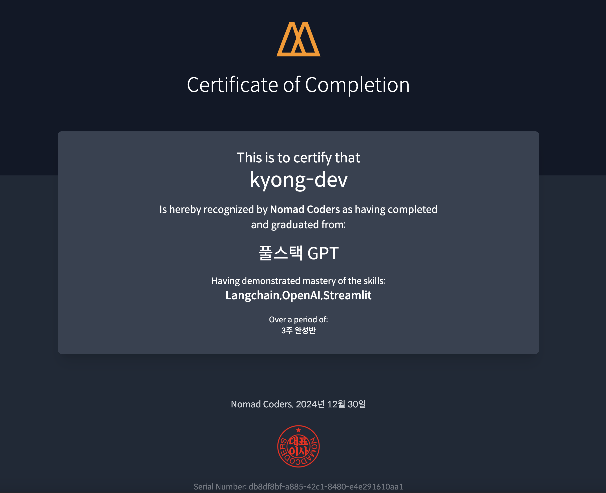
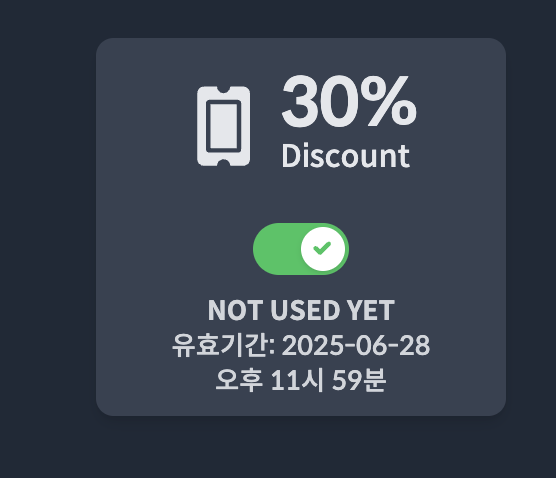

# 'GPT 활용은 이제 패시브지'

메인 프로젝트들을 진행하면서 부분적으로 LLM을 도입해 마이크로 서비스를 구축을 했다. (사업자등록증 자동인증) 물론 어렵고 화려한 스킬이 들어간 것이 아니지만 아주 간단히(?) 하루정도 소요 해서 마이크로서비스를 배포해서 기존 서버들과 연동해서 잘 사용하고 있다.

그 중 입시데이터를 활용해 챗봇을 만드는 서비스를 기획하는데 같이 참여를 했었는데 아주 흥미로웠다. AWS Cloud Day에 참석했을때 다양한 LLM의 활용사례를 알아보았고 그 서비스들을 제작하는데 필요한 데이터 Embedding, Vector Search, RAG 등 여러가지의 기술들이 접목되서 사용되고 있는 것을 알고 공부를 하고 싶다는 생각을 꾸준히 하던와 중이였다. 나중에 메인 프로젝트 데이터들을 활용해 고도화 하는데 필요할 것 같아서 미리 공부를 해놓기 위해 강의를 결제해 틈나는대로 보고 있었는데 Nomadcoder에서 챌린지를 시작한다고 해서 도전해 보았다!

노마드코더 챌린지는 1~3일 주기로 Assignment를 주고 해당 과제를 완료하면 깃허브에 업로드해 링크를 공유하는 식으로 진행됐다. 오랜만에 대학시절(?)로 돌아간 느낌으로 색다르게 다가왔다. 

일이 끝나고 새벽시간을 활용해 꾸준히 진행해온 결과 결과는 대성공!

Jupiter Notebook과 Streamlit을 활용해 다양한 GPT 활용법을 공부했다. 아직 부족하지만 원하는 서비스를 만들기 위해 활용방법 정도는 숙지했으니 만들면서 조금씩 다져가면 될 것 같다.

- Langchain
- Memory
- RAG
- DocumentGPT - 문서 기반 답변 생성
- PrivateGPT - 로컬 모델을 활용한 챗봇
- QuizGPT - 문서기반 퀴즈 생성 및 답변 채점
- SiteGPT - 사이트 크롤링을 활용한 답변 생성
- MeetingGPT - 미팅 음성을 기반으로 요약
- InvestorGPT - 데이터 기반 답변생성
- ChefGPT - 데이터베이스 연동해 레시피 생성 (API)
- Assistants
- AzureGPT & AWS Bedrock
- CrewAI

커리큘럼은 이렇다. 사실상 찍먹한 느낌이라 필요한 서비스를 만들면서 좀 더 공부해야겠다.
수료증과 30프로 강의 할인쿠폰을 받았는데 다음은 뭘 볼지 고민이 되는구만..

