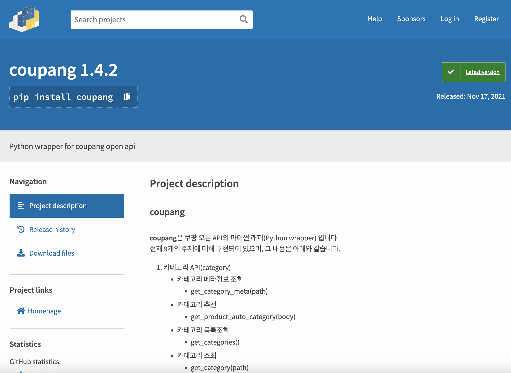

# Python 쿠팡 API Package 401 Unauthorized 오류 처리

Coupang은 <a href="https://developers.coupangcorp.com/hc/ko">Open API</a>를 제공하는 플랫폼 중 하나다.

필요한 부분만 딱 빼서 따로 기능을 넣어도 되지만 난 보통 Open API를 사용할때 일단 미리 능력자 분들이 만들어 놓은 패키지가 있지 않을까 구글링을 먼저 해본다. 

Eureka! 역시 어떤 능력자 분이 먼저 만들어 놓으셨구나 ㅋㅋ 종종 API 공급 플랫폼 자체에서 패키지를 만들어 제공하는 경우는 있긴하지만 쿠팡은 없는 것 같다.

적용 하는 방법은 아래 깃헙 리포 README.md에 잘 설명되어 있어서 패스~  
<a href="https://github.com/kyungdongseo/coupang">https://github.com/kyungdongseo/coupang</a>  

내가 필요한 부분은 정산프로그램에 사용할 예정이기 때문에 정산API에서 히스토리 불러오는 함수를 import해서 결과값 출력 테스트

    from coupang.settlement import settlement_histories

    for history in settlement_histories({'revenueRecognitionYearMonth': '2022-03'}):
        print(history)

    for history in settlement_histories({'revenueRecognitionYearMonth': '2022-04'}):
        print(history)

경건한 마음으로 프로그램을 실행해 본다. (이때가 가장 떨림)

아니나 다를까 **401 Unauthorized** 에러를 뱉으며 줄줄이 올라오는 오류 메세지.. 이게 무슨일 일까 쿠팡에서 그새 API를 수정한 건지 살펴본다. 하지만 찾을 수 없다. 뭐가 문젤까 오류 메세지를 살펴보지만 모르겠다.  

열심히 구글링을 한 결과 지금은 어디였는지 기억이 안나지만 한 블로그 웹페이지에서 파이썬 샘플 코드 타임존 수정에 오류가 있다는 글을 보고 변경 적용해 봤는데 결과적으론 정보 불러오기 성공! 누구신지 커피한잔 사드리고 싶네 ㅠ 
<a href="https://developers.coupangcorp.com/hc/ko/articles/360033396034-Python-Example">파이썬 샘플코드</a>  

패키지 안에 coupang/common.py의

    def date_time():
        os.environ['TZ'] = 'GMT+0'
        return time.strftime('%y%m%d')+'T'+time.strftime('%H%M%S')+'Z'

서버 시간을 GMT 기준시간으로 변경해서 string 포맷으로 return하는 부분을 찾아 아래 처럼 변경해 주면 된다! 위 코드를 MacOS에선 정상적으로 실행되지만
윈도우와 Ubuntu(Linux)에서는 Python 코드로는 타임존 수정이 안되서 제대로 적용이 되질 않는다. timedelta 함수를 이용해서 변경해주는 코드로 변경해주면 정상적으로 실행되는 것을 확인 할 수 있다!

    def date_time():
        from datetime import datetime, timedelta

        gmt_time = datetime.now() - timedelta(hours=9) #한국기준
        gmt_time_str = "{:%y%m%d}T{:%H%M%S}Z".format(gmt_time, gmt_time)

        return gmt_time_str
        
정산API 외 다른 API 메서드 들은 확인은 해보진 않았지만 정상적으로 작동 될걸로 예상된다!
