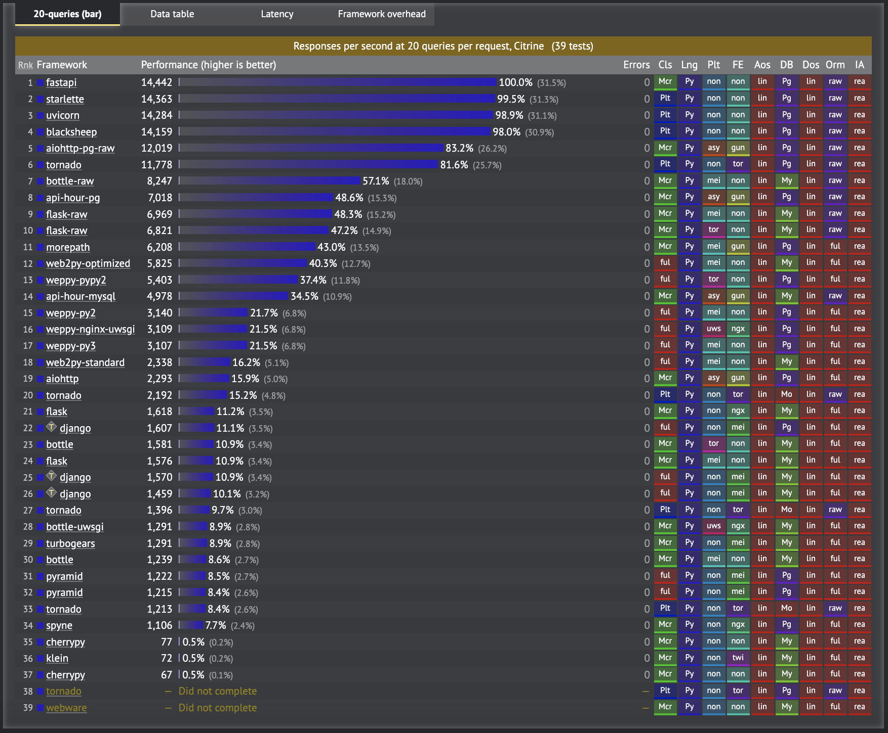

# 장고? 플라스크? 이제는 FastAPI!

파이썬 웹 프레임워크는 다양하다. 하지만 프로젝트를 계획할 때는 선택권이 많지 않다. 물론 프레임워크마다 장단점은 있겠지만 그 동안은 Django와 Flask 이 둘중 하나를 선택할 수 밖에 없었다. 이유는 친숙하기도 하지만, 오류가 해결되지 않을 때나 기능을 추가할 때 구글에 가장 많은 정보들이 공유되고 있기 때문이다. 오류처리 속도나 빌드 속도가 압도적으로 빠르고 편하다. 개인적으로는 Flask가 빌드하기 빠르고 무겁지 않아서 테스트용이나 작은 프로젝트 서버로 애용한다.

근데 데이터 양이 많아지고 프로세스가 조금만 복잡해져도 속도 저하가 심해서 이점을 개선하고 싶었다. 이제 파이썬을 버릴때가 온것인가.. 얼마 전 회사 내부 이용하는 프로그램의 서버 속도 개선을 위해 새로운 웹 프레임워크를 찾던 중 발견한 **FastAPI**.

FastAPI는 아직 1.0 버전이 정식 출시되지 않은 베타버전이지만 이름에 걸맞는 빠른 Performance 속도 덕분에 가파른 속도로 점유율이 오르고 있다.
<a href="https://www.techempower.com/">Techempower</a>라는 웹 프레임워크 비교사이트에 따르면, 멀티 쿼리 벤치마크에서 FastAPI가 당당히 1등을 차지하고 있는 것을 볼 수 있다.

 

도전해볼만한 가치가 있는 것 같았다. 아직 많이 보편화 되어 있진 않지만 공식문서가 아주 잘 정리되어 있기도 하고 생각보다 많은 곳에서 무료 동영상 튜토리얼도 찾아볼 수 있었다. 며칠 동안 자기전에 뚝딱뚝딱 <a href="https://www.youtube.com/c/Freecodecamp">freeCodeCamp.org</a> 유튜브 채널에 올라온 영상을 보며 따라 만들어 봤는데 사용하기 직관적이고 편한 것 같다.
  

 
<a href="https://github.com/kyong-dev/fastapi_microservices">Microservice Course Github Repository</a>

 조금 더 파보고 속도 측면에서 좋은 결과만 있다면 내부 API로 이용할 예정이다.