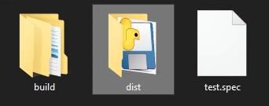

# '파이썬으로 윈도우용 exe 프로그램 제작'

동료디자이너가 필요한 웹으로 만들기는 가볍운 툴이 필요해 테스트용으로 코드를 뚝딱뚝딱해보니 생각보다 쉽게 구현이 될 것 같아서 가볍게 만들어주려고 한다.
디자이너가 사용하는 컴퓨터의 운영체제는 Windows 10이고 당연히 파이썬은 설치되어 있지 않다. <br />
구글링을 가볍게 해본 결과 Pyinstaller를 이용해서 윈도우에서 실행 가능한 exe 프로그램을 제작할 수 있다는 결론을 내리고 제작을 해보았다.  <br /><br />
단, 윈도우내에서 Pyinstaller를 이용해야지 윈도우용 프로그램이 나오더라.. 맥으로 몇번 빌드 해봤는데 윈도우에선 실행가능하지 않은 procore class 파일로 빌드가 된다.

<h2>1. Pyinstaller 설치</h2>
해당 프로젝트에 패키지 pip을 이용해 설치를 한다.

```bash
pip install pyinstaller
```

<h2>2. 명령어를 이용해 빌드</h2>
pyinstaller -w -F [filename]

```bash
pyinstaller -w -F image_validator.py
```

<table>
  <tr>
    <td style="width: 100px;">-F, --onefile </td>
    <td>Create a one-file bundled executable.</td>
  </tr>
  <tr>
    <td colspan="2">-w, -windowed, --noconsole</td>
  </tr>
  <tr>
    <td></td>
    <td>Windows and Mac OS X: do not provide a console window for standard i/o. On Mac OS X this also triggers building an OS X .app bundle. On Windows this option will be set if the first script is a ‘.pyw’ file. This option is ignored in *NIX systems.</td>
  </tr>
</table>


<h2>3. 프로그램 실행</h2>

실행하고 나면 프로젝트 폴더에 2개의 하위 폴더(build, dist)와 1개의 .spec  파일이 생성된다. <br />
dist 폴더 안에 exe파일이 만들어진다.


