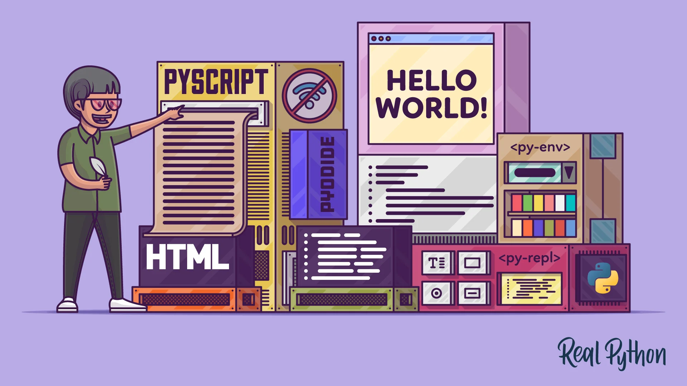
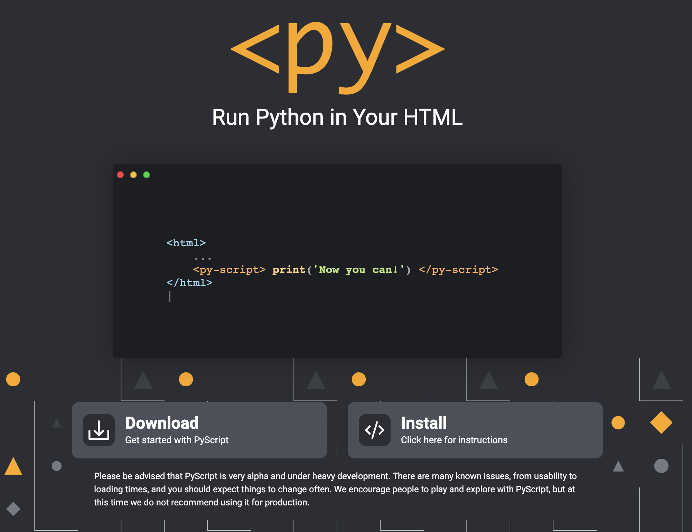

# '프론트에서 파이썬을??'

'프론트는 자바스크립트'라는 공식을 깨기 위해 여러가지 시도들이 계속되는 가운데. C# Blazor의 뒤를이을 신기술이 공개됐다. Run Python in Your HTML. 이름하여 Pyscript!

- 파일 호스팅, 서버사이드 렌더링이 필요 없는 앱개발 가능, 
- 파이썬 다양한 유명 패키지를 브라우저에서 사용 가능 (Numpy, Pandas, Scikit-learn 등)
- 파이썬과 자바스크립트 양방향 소통 가능
- 무슨 패키지를 사용할지 무슨 파일을 포함할 지 페이지 안에서 결정할 수 있음
- 비주얼 UI 컴포넌트를 파이썬으로 개발 가능
- 유연한 프레임워크: 확장이 가능하고 어디서든 불러와 손쉽게 사용할 수 있는 컴포넌트

다양한 장점들이 있지만 아직 베타버전도 아닌 알파 초기 버전이라서 2022년 7월 19일 기준 다양한 성능 이슈와 안정성에 문제가 있기 때문에 토이 프로젝트 정도에만 적용을 하도록 공식홈페이지에 권고하고 있다.

어서 발전해서 파이썬을 메인 프로젝트에 차용을 할 수 있는 날이 왔으면 좋겠다.