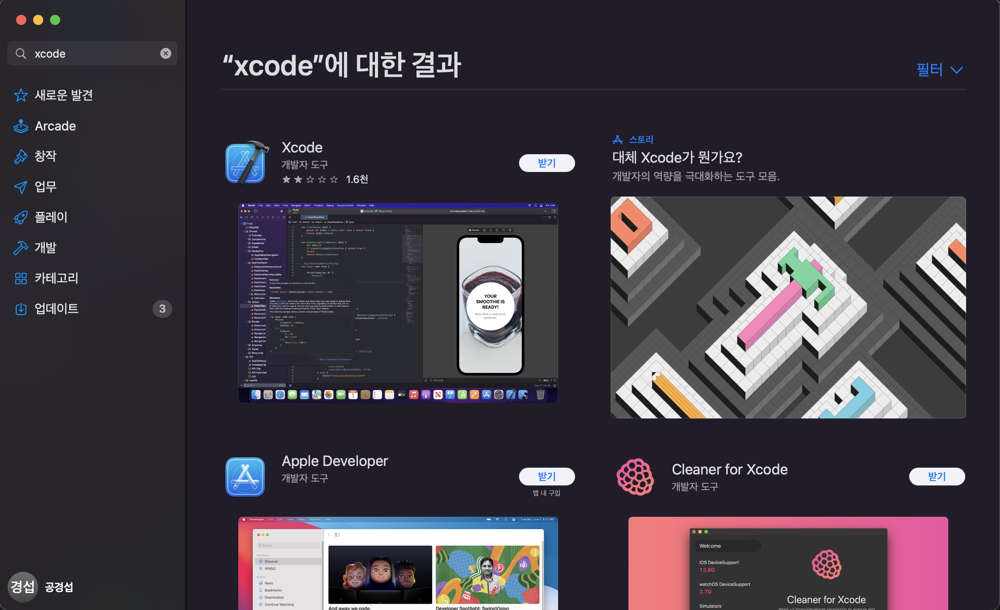
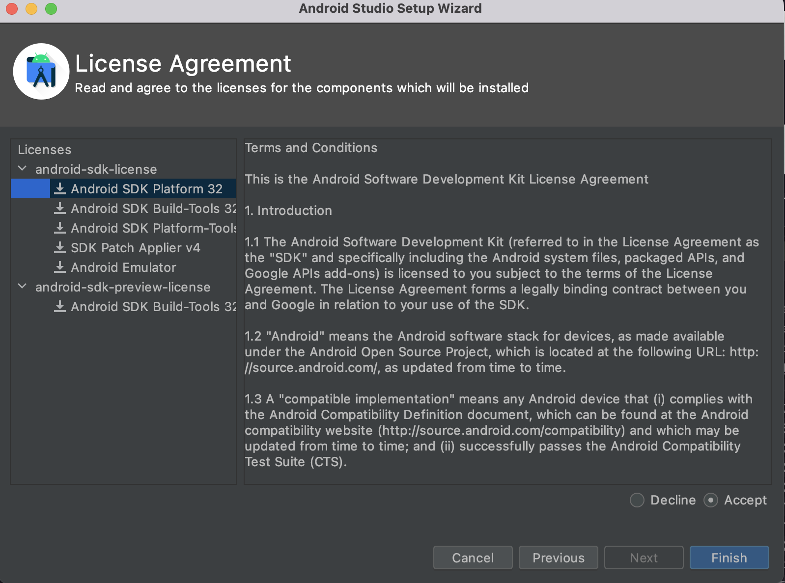
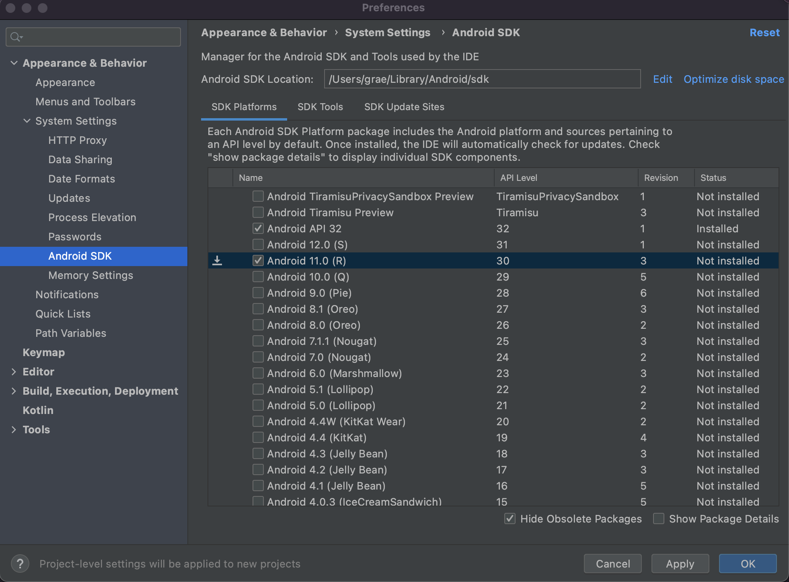
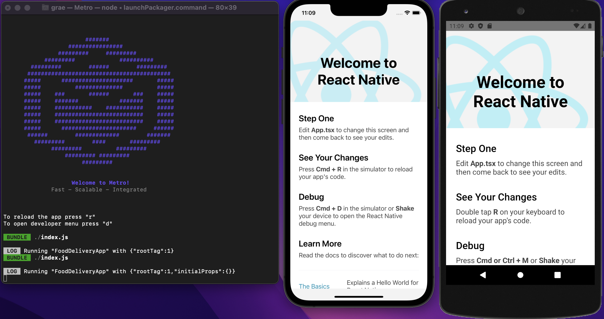

# '리액트 네이티브 개발용 환경설정하기'

오랜만에 앱개발 공부하려고 제로초님의 리액트 네이티브 강좌를 인프런에서 결제했다.
React Native로 내 서비스 만들어 배포하고 싶은 마음에 시작한 앱공부.. 앱 서비스 회사가 아니여서 요 몇 년은 앱개발과 멀어졌었는데 천천히 다시 공부해보려고 한다.

회사에서 Mac을 지원받으면서 이제 맥이 생겼으니 Expo 환경 말고 React Native Cli 버전으로 빌드 해볼 수 있겠구나! 맥 개발환경 세팅을 하려면 일단 <a href="https://reactnative.dev/docs/environment-setup">공식문서</a>를 보고 따라하는게 제일 좋다.

# <a href="https://brew.sh/">Homebrew</a>를 이용해 패키지 설치.

노드는 14 버전 혹은 그 이상의 버전이 추천된다. 워치맨은 페이스북이 개발한 파일시스템 변경 추적툴이다.

```bash
brew install node
...
==> Upgrading node
  17.0.1 -> 18.0.0 

brew install watchman
...
==> Installing watchman
==> Pouring watchman--2022.03.21.00_1.monterey.bottle.tar.gz
🍺  /usr/local/Cellar/watchman/2022.03.21.00_1: 22 files, 11.7MB
==> Running `brew cleanup watchman`...
Disable this behaviour by setting HOMEBREW_NO_INSTALL_CLEANUP.
Hide these hints with HOMEBREW_NO_ENV_HINTS (see `man brew`).
```

```bash
brew tap homebrew/cask-versions
Cloning into '/usr/local/Homebrew/Library/Taps/homebrew/homebrew-cask-versions'...
remote: Enumerating objects: 245591, done.
remote: Counting objects: 100% (9/9), done.
remote: Compressing objects: 100% (7/7), done.
remote: Total 245591 (delta 2), reused 8 (delta 2), pack-reused 245582
Receiving objects: 100% (245591/245591), 62.95 MiB | 1.52 MiB/s, done.
Resolving deltas: 100% (169858/169858), done.
Tapped 216 casks (246 files, 69.8MB).

brew install --cask zulu11
==> Downloading https://cdn.azul.com/zulu/bin/zulu11.56.19-ca-jdk11.0.15-macosx_
######################################################################## 100.0%
==> Installing Cask zulu11
==> Running installer for zulu11; your password may be necessary.
Package installers may write to any location; options such as `--appdir` are ignored.
Password:
installer: Package name is Azul Zulu JDK 11.56+19
installer: Installing at base path /
installer: The install was successful.
🍺  zulu11 was successfully installed!
```
나는 기존에 노드가 설치되어 있어서 업그레이드만 됐고 워치맨은 설치가 안되어 있어서 관련 dependencies과 함께 설치가 완료됐다.


```bash
sudo gem install cocoapods
...
Done installing documentation for concurrent-ruby, i18n, tzinfo, zeitwerk, activesupport, nap, fuzzy_match, httpclient, algoliasearch, ffi, ethon, typhoeus, netrc, public_suffix, addressable, cocoapods-core, claide, cocoapods-deintegrate, cocoapods-downloader, cocoapods-plugins, cocoapods-search, cocoapods-trunk, cocoapods-try, molinillo, atomos, colored2, nanaimo, rexml, xcodeproj, escape, fourflusher, gh_inspector, ruby-macho, cocoapods after 43 seconds
34 gems installed

```
# <a href="https://developer.apple.com/xcode/">Xcode</a>와 <a href="https://developer.android.com/studio">Android Studio</a>설치

- 설치하면서 Xcode도 같이 <a href="https://apps.apple.com/kr/app/xcode/id497799835?mt=12">App Store</a>에서 설치해준다.



- Android Studio도 <a href="https://developer.android.com/studio">공식홈페이지</a>에서 다운을 받아주고 설치해준다.



- Appearance & Behavior > System Settings > Android SDK에서 **Android 11.0(R)**도 추가로 설치해준다 



Xcode 시뮬레이터와 안드로이드 스튜디오 에뮬레이터를 원하는 기종으로 설치해준다 (나 같은 경운 안드로이드용으론 Nexus 5 설치함)

- React Native 설치 및 프로젝트 init
```bash
npm i -g react-native
```

```bash
react-native init FoodDeliveryApp --template react-native-template-typescript
```

```bash
npm run android
npm run iso
```



아이폰이랑 안드로이드 가상으로 올리기 성공! 항상 느끼지만 환경세팅이 가장 어려운듯 ㅠ
