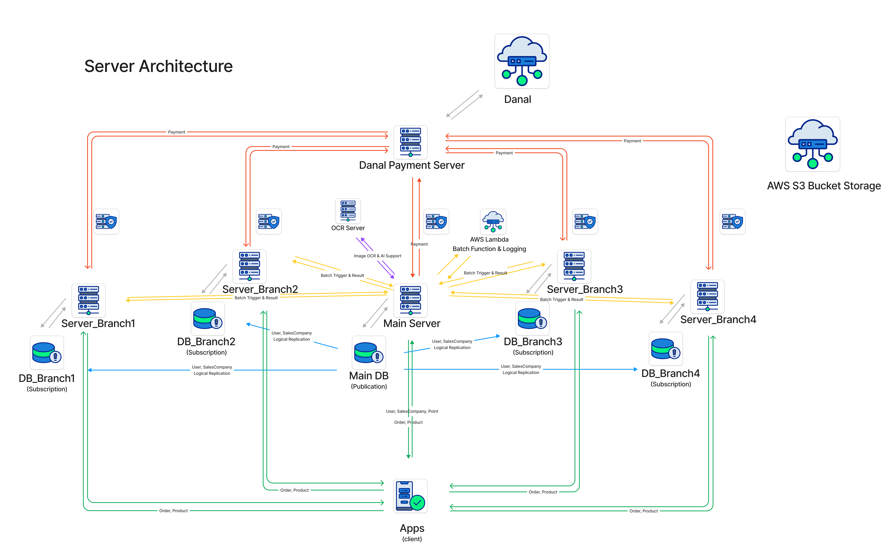

# '앱서비스 지점 확장에 따른 아키텍쳐 설계는 어떻게 하는게 좋은가?'

2024년 가장 큰 도전이자 가장 힘들었던 시스템 설계를 가장 프레쉬한 상태에서 기록을 남기기 위해 블로그를 작성한다.

지금 담당하고 있는 서비스의 태초의 목적은 단순히 '우리 유통사가 관리하는 고객이 앱에서 식자재 상품을 주문을 하면 배송을 하게 만들어줘'로 시작된 서비스였고, 현재는 고도화를 진행하여 아주 여러가지 프랜차이즈 관리용 기능과 지점확장이 추가되었다. 자세히 얘기하자면 아주 길어지는 포스팅이 되기에 그 중 가장 challenging 했던 작업중 하나인 지점 확장에 대해 얘기하려고 한다.

기존에 전달 받았던 프로젝트의 규모는 React Native 퍼블리싱 회사에서 외주로 만든 아주 난잡한 상태 + 렌더링 덕지덕지로 성능 이슈가 아주 컸던 앱이였고, Django 단일 서버로 EC2 몰빵에 Database는 파일형 데이터베이스인 SQLite로 구성되었던 상태 였다. 만약 처음에 내가 이 회사에 입사에 이 프로젝트를 끌고 가야된다고 했다면 바로 짐싸서 나왔을 정도로 최악이였던 프로젝트 상황..

외주로 시작해서 요구한 기능들만 개발해주면 알아서 그때 담당 개발자 분이 업데이트 해주실거라고 생각하고 시작을 했었다. 서버 업데이트 할때 갑자기 AWS 접근 권한을 넘겨주더니 그 뒤론 연락도 잘 안되고.. 서버 설정이 어떤식으로 되어있는지 한개도 모르는 상태에서 서버 ssh 접속 + 서버 코드로만 프로젝트와 서버 설정을 이해를 해야하고 동시에 기능도 개발해야 하는 어처구니 없는 상황ㅠ 아무튼 각설하고 그런식으로 넘겨 받은 프로젝트를 부산/경남 지방 배송만 진행하고 있던 상황에서 수도권, 경북 지점을 따로 운영을 하고 싶다고 했었다.

자 그렇다면 방법을 생각해보고 옵션을 전달해줘서 선택을 할 수 있도록 하는 것이 개발자의 몫.

1. 단순히 앱 복제, 서버 복제 및 기본 정보만 수정해서 완전히 다른 앱과 서버를 만든다.
2. 한개의 서버에 모든 상품 정보를 밀어넣고 상품과 주문 등에서 지점을 필터해서 검색하고 구매할 수 있도록 한다.
3. 서버를 분리해서 각각의 서버가 소통해서 상품과 주문을 따로 관리 할 수 있도록 한다.
4. 도망간다.

여기서 조건이 있다.

- 판매사업자와 사용자 정보는 메인서버에서만 관리했음 좋겠다.
- 계약이 끝나고 다른 업체로 넘어가게 되면 상품 정보가 전부 변경될 가능성이 있다.
- 백오피스는 분리 되었으면 한다.
- 전체 지점의 주문 통계는 수집하고 싶다.

어렵다.. 이게 프리랜서 외주로 혼자 할만한 작업인가? 이때까지만 해도 식자재 B2B유통이 어떤식으로 흘러가는지 정말 1도 모르는 상황이라 온갖 상상의 나래를 펼치며 고민을 정말 많이 했던 것 같다.

일단 단일 프로젝트로 Foreign Key를 이용해 서로 연결되어있기 때문에 메인서버에서 유저정보만 가져오긴 불가능으로 보인다. 이제와서 유저와 판매사업자 서버를 분리해서 MSA 설계로 바꾸는 건 시간 관계상 불가능해 보였고. 그때 결정할 수 있는 선택권은 단 하나, 복제였다. PostgreSQL의 Logical Replication (논리 복제)를 이용해 특정 테이블들을 실시간 복제를 하는 식으로 문제를 해결해 보기로 했고 근 한달간 테스트서버들을 구축을 하고 시뮬레이션을 돌려봤는데 데이터베이스 마이그레이션만 조심하면 큰 문제 없이 잘 작동을 했다.

각 지점별 서버에서 단일 다날 결제 서버를 두고 결제 완료시 요청왔던 지점으로 주문완료 처리까지 다지점 확장에 유리한 구조를 설계해 보았고 현재 6개월 가량 운영 중이다. 논리복제 연동이 끊기면 다시 연동하는 작업이 아주 귀찮지만 불가능하진 않다. 실제로 논리 복제를 백업용으로 구축은 많이들 하시겠지만 특정 공유가 필요한 테이블들만 설정해서 하는 경우는 많지 않을 것으로 예상되지만 생각보다 쓸만하다. 하지만 제일 좋은건 Micro Server Architecture를 이용해서 분리해서 관리하도록 구성하는 것이 제일 좋다.

실제로 스프링부트로 MSA구성으로 포팅하는 기획을 하고 있기 때문에 어디까지나 임시로 사용하고 있는 서버 아키텍쳐이다. 참고바란다. 자세한 내용이 궁금하신 분들은 댓글 달아주시면 답변 드리도록 하겠습니다 :)

