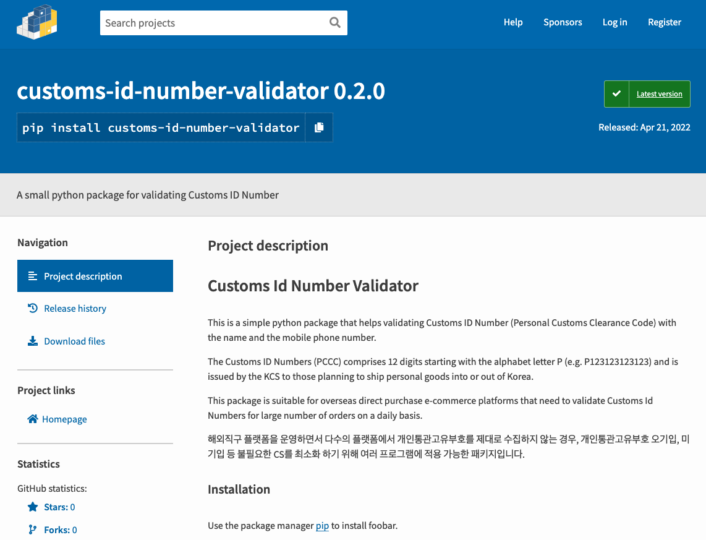

# 개인통관고유부호 확인할 수 있는 관세청 OPEN API v3.0

회사에서 운영하는 직구 플랫폼이 있다보니 개인통관고유부호 확인에 들어가는 CS가 만만치 않다. 과거에 운영했던 의류직구 플랫폼엔 관세청 API를 이용해 실시간 검증을 도입했었다 (개인통관고유부호와 수취인 정보와 같아야 주문완료 되는 시스템). 

현재는 워낙 다양한 오픈마켓 및 자사스토어에서 주문을 받고 그 주문들을 **사방넷**이라는 통합관리시스템을 이용해 주문을 수집해서 처리한다.

그렇다 보니 개인통관고유부호를 입력하지 않은 주문, 수취인이 아닌 주문자의 개인통관고유부호를 입력한 주문, 개인통관고유부호를 틀리게 입력한 경우 등등 다양한 상황이 발생한다. 개인통관고유부호 유효성 검증을 해주는 페이지들이 존재하기도 하고 토스토스 플랫폼 내에 대량으로 확인을 할 수 있게 서비스도 제공 해주고 있지만 손이 많이 간다. 다량의 주문일수록 처리시간도 늘어나고 그만큼 인력이 추가로 든다. 

### 그럴때 필요한건 **'프로그램'**!

사실 엑셀 변환 프로그램을 몇 개 제작해서 쇼핑몰부서 팀이 사용하고 있었는데 그 프로그램들에 개인통관고유부호 유효성 검증 기능이 들어가 있었는데 이번에 유니패스 오픈API가 3.0으로 리뉴얼되면서 관세청에 등록된 휴대폰번호도 일치해야 검증이 되도록 변경되면서 알고리즘이 살짝 복잡해졌다. 복잡해진김에 PyPi 패키지로 제작해 배포해봤고 다른 프로젝트들에서 땡겨서 쓸 수 있게 만들었다.

<a href="https://pypi.org/project/customs-id-number-validator/">https://pypi.org/project/customs-id-number-validator/</a>

<a href="https://pypi.org/project/customs-id-number-validator/" rel="PyPi Package"></a><br />

함수의 매개변수는 3가지를 받는다.

1. 개인통관고유부호 P를 포함한 13자리 문자열
2. 주문자 and 수취인 성명 String List. 이 때 이름은 여러 개를 입력해도 된다.
3. 전화번호 String List

<strong>예) 
```python
validate('P123123123123', ['성명일', '성명이'], ['010-1234-1234', '010-5678-5678'])
```
</strong>

이렇게 입력하면

먼저, 개인통관고유부호와 첫번째 이름과 첫번째 전화번호를 이용해 검증해보고 그 다음 다른 이름과 휴대번호랑 대조해보고 맞는 결과값이 있으면 유효할 시 결과값 리턴

```python
{'success': True, 'customsIdNumber': 'P123123123123', 'name': '성명일', 'phone': '010-1234-1234', 'errors': []}
```
오류 발생시 

```python
{'success': False, 'customsIdNumber': 'P123123123123', 'name': '성명일', 'phone': 010-1234-1234', 'errors': ['납세의무자 휴대전화번호가 일치하지 않습니다.']}
```
에러에 오류메세지를 추가해서 리턴한다.

만약 수취인 개인통관고유부호가 아닌 주문자의 정보를 입력했다면 프로그램 결과값에서 변경되어 리턴되기 때문에 수취인의 이름과 번호를 결과값 이름과 번호로 변경해서 주문을 처리하면 된다.

자세한 패키지 사용방법은 깃허브 README.md에 설명되어 있다.