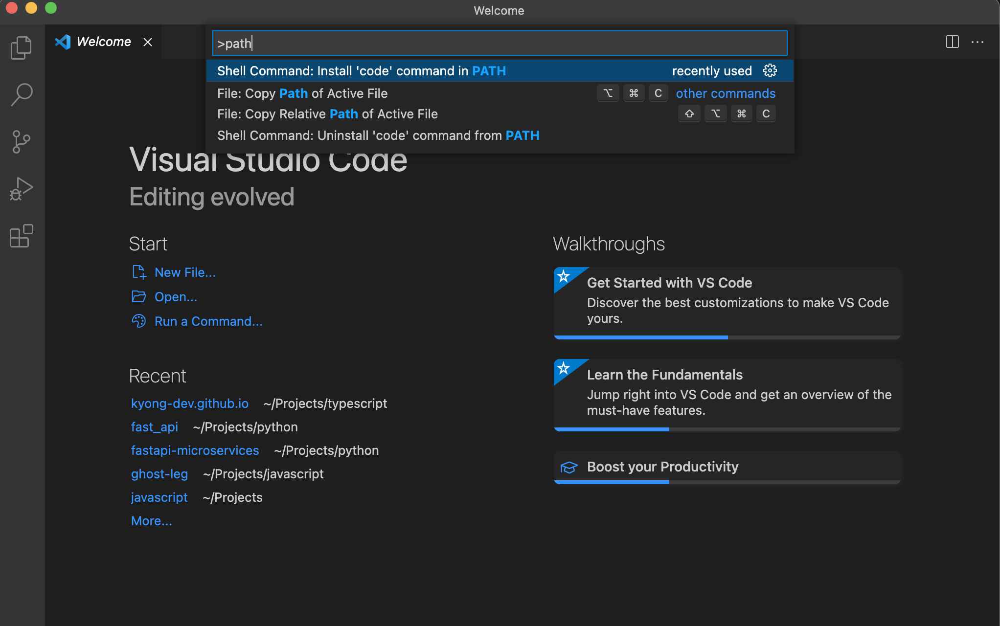

# Mac에서 터미널로 VS Code 간편하게 실행시키기

Mac으로 개발을 시작하기 전까진 개발 메인 OS로는 Ubuntu를 꽤나 오래 써왔다. 그리고 IDE는 다양하게 많이 사용 해봤지만 VS Code가 개인적으로 사용하기 편하다. 필자는 컴퓨터를 키고 항상 버릇처럼 터미널을 열고 내가 지금 개발하고자 하는 프로젝트 Path를 찾아가서 

    code .

이렇게 명령어를 치면 해당 프로젝트를 바로 작업할 수 있는 상태로 Visual Studio Code를 실행시킨다. 
하지만, 맥에서 VS Code를 설치만 한다고 바로 적용 되는 것이 아니기 때문에 몇 가지 설정을 해줘야 하는데 알아보도록 하자.

이미 프로그램을 설치해서 사용하고 있다고 가정한 상태로 설명한다.

2가지 방법이 있지만 첫번째 방법은 재부팅 할 때마다 반복해줘야 하기 떄문에 별로 추천하지 않지만 설명은 해야겠지..?

## 1. VS Code 내에서 PATH 등록하기

VS Code를 실행 -> Command + Shift + P를 누르고 'path'를 입력 -> `Shell Command: Install 'code' command in PATH` 를 실행

재부팅되기 전까진 **code** 명령어를 사용해서 VS Code를 실행할 수 있다.

## 2. 영구적으로 PATH 등록하기

터미널에서 `code`를 실행시켜 뭐라고 나오는지 확인해보고 Shell 종류에 따라 알맞게 Heredoc을 이용해 터미널에서 Path를 추가해주자.

    -bash: code: command not found

이렇게 나온다면 아래 명령어를 실행 해주면 된다.

    cat << EOF >> ~/.bash_profile

    export PATH="\$PATH:/Applications/Visual Studio Code.app/Contents/Resources/app/bin/"
    EOF

혹은, 아래와 같은 결과가 출력된다면

    zsh: command not found: code

zshell(zsh)을 이용하는 것이므로 `~/.bash_profile` -> `~/.zshrc` 로 변경해주고 실행 해주면 된다. 아자!

    cat << EOF >> ~/.zshrc

    export PATH="\$PATH:/Applications/Visual Studio Code.app/Contents/Resources/app/bin/"
    EOF

---

**References**
- Foundy. (2022, Apr 2). Visual Studio Code 맥 터미널에서 code 명령어 PATH 설정하기 [Blog post]. Retrieved from http://blog.foundy.io/visual-studio-code-maeg-teomineoleseo-code-myeongryeongeo-path-seoljeonghagi/

